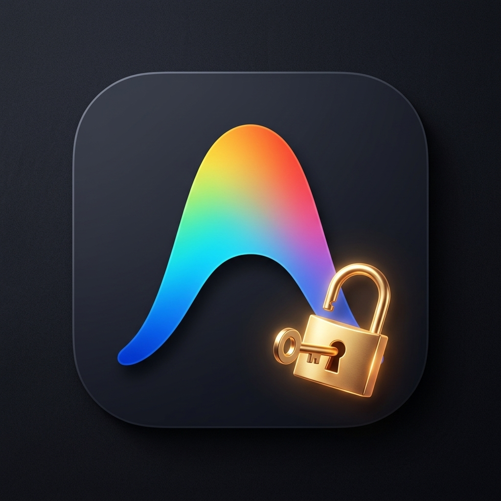
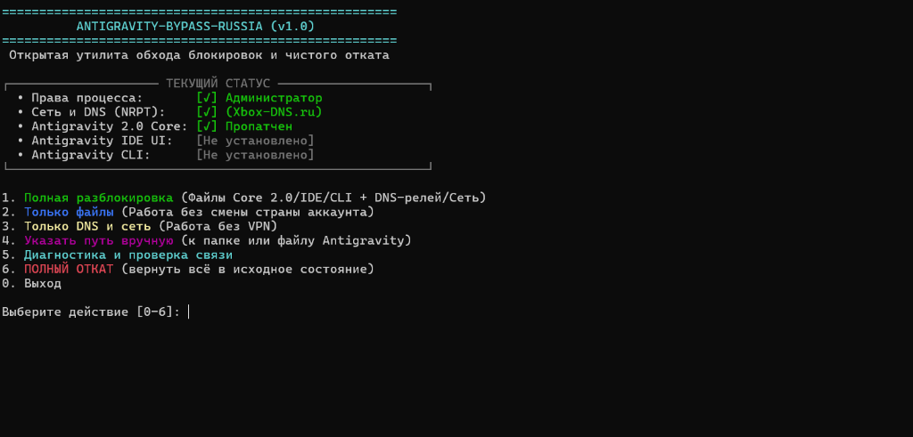

<div align="center">



# ANTIGRAVITY-BYPASS-RUSSIA

### Разблокировка Google Antigravity & Gemini 2.0 в России
**Без VPN • Без смены страны Google-аккаунта • На полной скорости вашего интернета**

[](README.md)
[](README.md)
[-8A2BE2.svg?style=flat-square&logo=rust&logoColor=white)](https://github.com/vezlin1/antigravity-bypass-russia/releases)
[](LICENSE)

<p align="center">
  <a href="#что-это-такое">О проекте</a> •
  <a href="#быстрый-старт">Быстрый старт</a> •
  <a href="#как-это-работает">Как это работает</a> •
  <a href="#поддерживаемые-редакторы">Поддержка</a> •
  <a href="#часто-задаваемые-вопросы-faq">FAQ</a> •
  <a href="#чистый-откат">Откат</a> •
  <a href="#сборка-из-исходников">Сборка</a>
</p>

</div>

---

## Что это такое

**Antigravity Bypass Russia** — бесплатная открытая утилита, которая устраняет региональные блокировки (**`User is ineligible`**, **`Location not supported`**) в **Google Antigravity**, **Gemini 2.0**, **Antigravity IDE** и расширениях для **VS Code / Cursor / Windsurf**.

Вам **больше не нужно**:
- Держать постоянно включённым медленный зарубежный VPN;
- Менять регион своего основного Google-аккаунта или создавать иностранные профили;
- Терпеть обрывы соединения и высокий пинг при генерации кода.

### Сравнение способов работы

| Возможность | Обычный VPN | Прокси / SOCKS5 | Antigravity Bypass |
| :--- | :---: | :---: | :---: |
| **Скорость интернета** | ❌ Падает в 3-5 раз | ⚠️ Зависит от сервера | ✅ **100% скорость провайдера** |
| **Нагрузка на систему** | ⚠️ Фоновое приложение | ⚠️ Фоновый процесс | ✅ **0% CPU (Native Rust)** |
| **Авто-разблокировка редакторов** | ❌ Нет | ❌ Нет | ✅ **IDE, Cursor, Windsurf, CLI** |
| **Возврат в исходное состояние** | ⚠️ Ручная очистка | ⚠️ Сложно | ✅ **1 клик (Чистый откат)** |

<br/>

<div align="center">
  
</div>

---

## Быстрый старт

### Windows 10 / 11

#### Вариант 1: Готовый файл (Рекомендуется)
1. Скачайте [**`antigravity-bypass-russia.exe`**](https://github.com/vezlin1/antigravity-bypass-russia/releases/latest) из раздела релизов.
2. Запустите файл двойным кликом (при запросе подтвердите запуск от имени Администратора).
3. В появившемся меню введите **`1`** (**`Полная разблокировка`**) и нажмите **Enter**.
4. После сообщения «Готово!» запустите Antigravity и войдите в свой Google-аккаунт.

> [!TIP]
> **Предупреждение Windows SmartScreen:**  
> Это стандартное уведомление Windows для новых открытых утилит без платного сертификата Microsoft. Нажмите *«Подробнее» → «Выполнить в любом случае»*. Исходный код полностью открыт для проверки.

#### Вариант 2: Запуск через PowerShell (Без скачивания .exe)
<details>
<summary><b>Инструкция для PowerShell</b></summary>

1. Скачайте архив проекта: **[Download ZIP](https://github.com/vezlin1/antigravity-bypass-russia/archive/refs/heads/main.zip)** и распакуйте папку.
2. Запустите **PowerShell от имени администратора**, перейдите в папку проекта и выполните:
   ```powershell
   Set-ExecutionPolicy -Scope Process -ExecutionPolicy Bypass
   .\scripts\unlock_and_restore.ps1
   ```
3. В меню выберите пункт **`1`**.
</details>

---

### macOS (Apple Silicon M1–M4 & Intel)

1. Откройте **Терминал** и выполните команду:
   ```bash
   git clone https://github.com/vezlin1/antigravity-bypass-russia.git
   cd antigravity-bypass-russia
   chmod +x scripts/unlock_and_restore.sh
   sudo ./scripts/unlock_and_restore.sh
   ```
2. В интерактивном меню выберите пункт **`1. Полная разблокировка`**. Скрипт настроит системный резолвер и снимет региональные ограничения.

---

## Как это работает

Утилита работает точечно и полностью локально на вашем компьютере:

- **Прямой интернет (100% скорости):**  
  Весь ваш обычный трафик (браузер, игры, мессенджеры) идёт напрямую через вашего провайдера без задержек.
- **Селективная маршрутизация (SmartDNS):**  
  Только служебные запросы к серверам Google AI направляются через локальный DNS-релей. Лишний трафик через релей не проходит.
- **Локальный патч региона:**  
  Снимает внутреннюю проверку страны в ядре Antigravity, позволяя использовать ваш основной рабочий аккаунт.

> [!NOTE]
> **Конфиденциальность:** Программа не сохраняет пароли, не перехватывает SSL-сертификаты, не читает ваш код и не собирает телеметрию.

---

## Поддерживаемые редакторы

- **Antigravity IDE** — автономная среда разработки от Google;
- **Ядро Antigravity 2.0 (`language_server`)** — для процессоров x64 и ARM64;
- **Расширения Antigravity** для **Visual Studio Code**, **Cursor**, **Windsurf**, **VS Code Insiders** и **VSCodium**;
- Консольная утилита **Antigravity CLI (`agy`)**.

---

## Часто задаваемые вопросы (FAQ)

<details>
<summary><b>1. Нужен ли теперь постоянный VPN для работы в Antigravity?</b></summary>
<p>
<b>Нет, не нужен.</b> После применения разблокировки Antigravity и Gemini работают напрямую через ваш обычный домашний или мобильный интернет.
</p>
</details>

<details>
<summary><b>2. Безопасно ли это для Google-аккаунта и системы?</b></summary>
<p>
<b>Абсолютно безопасно.</b> Проект полностью Open Source. Программа не крадёт токены, не подменяет SSL-сертификаты и не отправляет личные данные. Исходный код доступен для независимого аудита в этом репозитории.
</p>
</details>

<details>
<summary><b>3. Замедлится ли скорость интернета или онлайн-игр?</b></summary>
<p>
<b>Ни на миллисекунду.</b> Утилита не является VPN-сервером и не перенаправляет общий трафик. Настройка применяется исключительно к доменам Google AI.
</p>
</details>

<details>
<summary><b>4. Что делать при обновлении Antigravity IDE?</b></summary>
<p>
Если после обновления редактора снова появится сообщение о недоступности региона — просто запустите утилиту ещё раз и выберите пункт <b>1</b>.
</p>
</details>

<details>
<summary><b>5. Что делать, если при входе возникает бесконечная загрузка?</b></summary>
<p>
1. Запустите утилиту и выберите <b>Пункт 5 (Диагностика)</b>, чтобы проверить связь с серверами Google.<br>
2. Закройте Antigravity IDE.<br>
3. Выполните <b>Пункт 1</b> заново (это сбросит устаревший кэш сессий V8 и обновит сетевой стек).
</p>
</details>

<details>
<summary><b>6. Как полностью удалить изменения и вернуть всё к исходному состоянию?</b></summary>
<p>
Запустите утилиту и выберите пункт <b><code>6. ПОЛНЫЙ ОТКАТ</code></b>. Программа восстановит оригинальные файлы из резервных копий <code>.bak</code>, очистит сетевые правила и вернёт систему к исходному состоянию.
</p>
</details>

---

## Чистый откат

Если вы решите полностью удалить изменения:
1. Запустите `antigravity-bypass-russia.exe` (или скрипт).
2. Выберите пункт **`6. ПОЛНЫЙ ОТКАТ`**.
3. Программа автоматически:
   - Восстановит оригинальные файлы ядра и интерфейса из резервных копий `.bak`;
   - Удалит записи маршрутизации (NRPT на Windows / `/etc/resolver/` на macOS);
   - Сбросит системный кэш DNS и кэш сессий V8;
   - Очистит переменные окружения.

---

## Сборка из исходников

Если вы хотите собрать бинарный файл самостоятельно:

```bash
# Клонирование репозитория
git clone https://github.com/vezlin1/antigravity-bypass-russia.git
cd antigravity-bypass-russia

# Сборка релизной версии с максимальной оптимизацией (Fat LTO)
cargo build --release
```
Готовый исполняемый файл будет создан в папке: `target/release/`.

---

## Благодарности

Проект вдохновлен наработками и концепциями:
- [confeden/Antigravity](https://github.com/confeden/Antigravity)

---

## Лицензия и отказ от ответственности

- Проект распространяется под свободной лицензией **[MIT License](LICENSE)**.
- Все товарные знаки, названия и логотипы (*Google, Antigravity, Gemini, VS Code, Cursor, Windsurf*) принадлежат их законным правообладателям.
- Проект создан исключительно в исследовательских и образовательных целях для обеспечения совместимости инструментов разработки.
